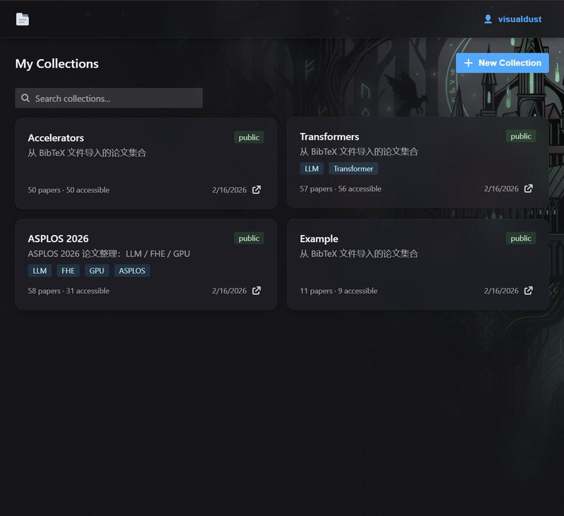
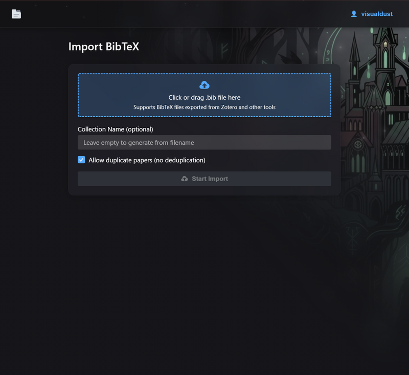
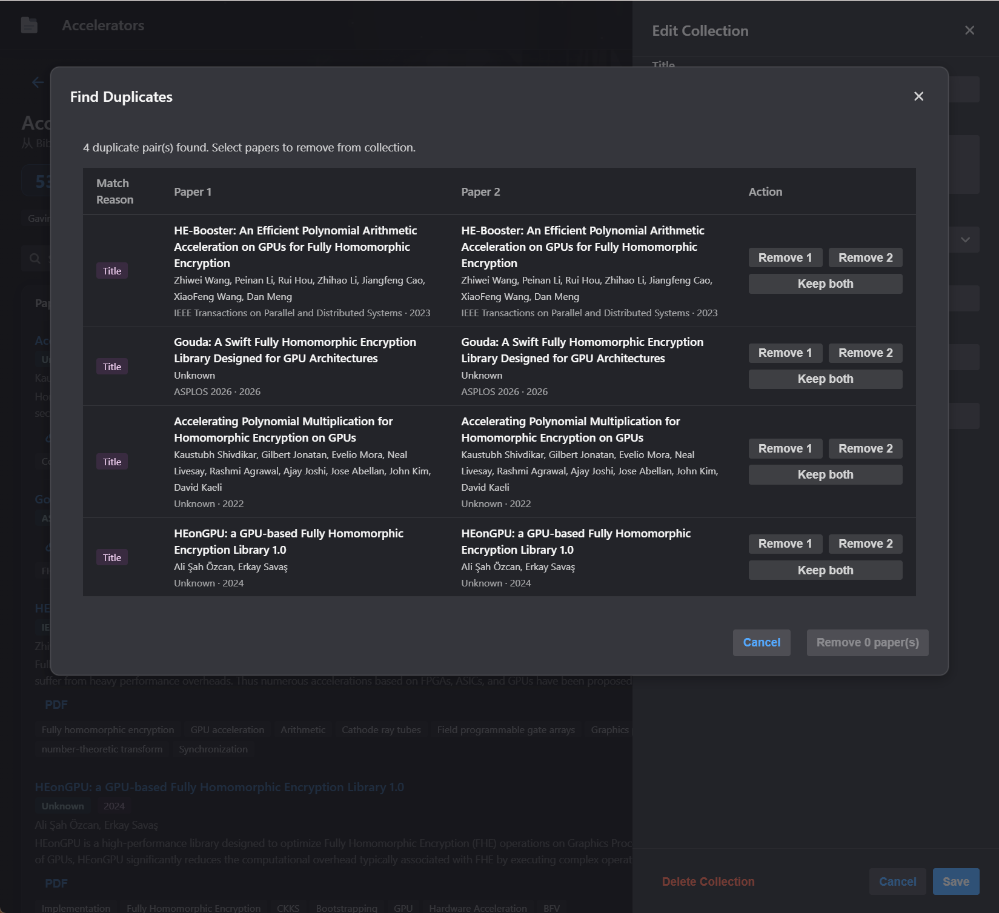
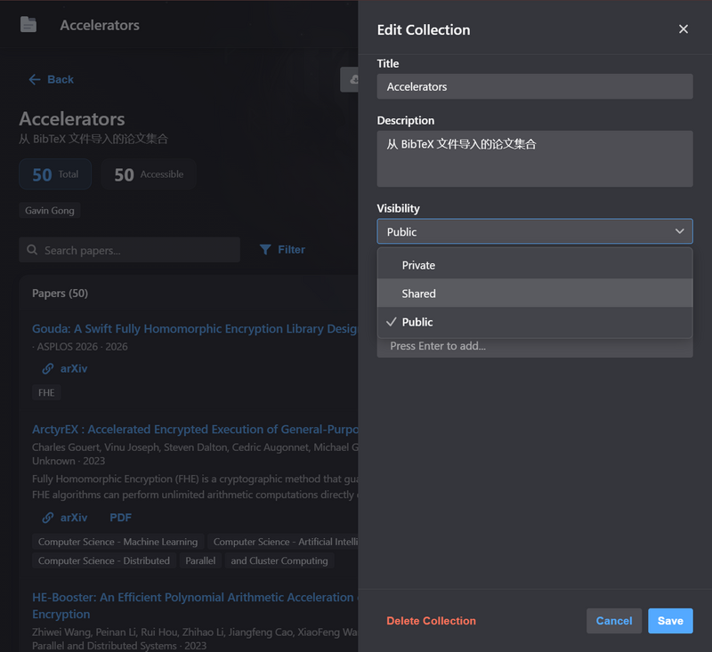

# Share bib

A simple, self-hosted tool for managing and sharing BibTeX collections with labmates.

## Typical workflow

You curate papers in Zotero → right-click a collection → Export Collection → `.bib` → upload it here.

Your labmate opens the link you shared → exports the `.bib` → imports it into their own Zotero. Done.

<table>
  <tr>
    <td></td>
    <td></td>
  </tr>
  <tr>
    <td></td>
    <td></td>
  </tr>
</table>

## Features

- Self-hosted, local login or OAuth
- Import and export `.bib` files (works with Zotero, etc.)
- Duplication detection and merging
- Organize papers into collections with per-user access control
- i18n support (English, 中文)
- Desktop and mobile page layout

## Deploy with Docker

```yaml
# docker-compose.yml
services:
  share-bib:
    image: ghcr.io/visualdust/share-bib:latest
    ports:
      - "80:80"
    volumes:
      - ./data:/data
    restart: unless-stopped
```

```bash
docker compose up -d
```

Open `http://localhost` and follow the setup wizard to create your admin account.

### Environment variables

| Variable         | Default        | Description                                                    |
| ---------------- | -------------- | -------------------------------------------------------------- |
| `PORT`           | `80`           | Host port mapping                                              |
| `JWT_SECRET_KEY` | auto-generated | JWT signing key (persisted to `data/config.yaml` on first run) |
| `AUTH_TYPE`      | `simple`       | Auth mode: `simple` or `oauth`                                 |

### Data

All persistent data (database, config) is stored in the `./data` volume. Back up this directory to migrate.

## Local development

```bash
# Start backend + frontend in tmux
./scripts/start.sh

# Stop
./scripts/stop.sh
```

Requires: Python 3.13+, Node.js 20+, [uv](https://docs.astral.sh/uv/), tmux

## Build from source

```bash
docker build -t share-bib .
docker run -d -p 80:80 -v ./data:/data share-bib
```
