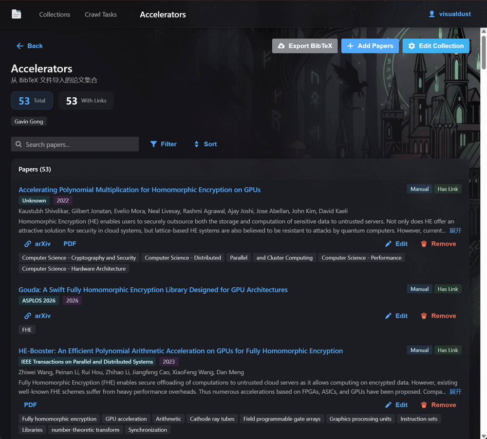
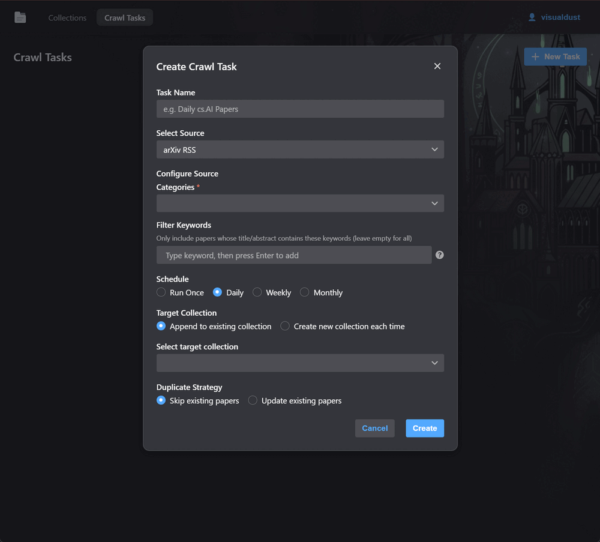

# Share bib

A simple, self-hosted tool for managing and sharing BibTeX collections with labmates.

## Typical workflow

You curate papers in Zotero → right-click a collection → Export Collection → `.bib` → upload it here.

Your labmate opens the link you shared → exports the `.bib` → imports it into their own Zotero. Done.

<table>
  <tr>
    <td></td>
    <td></td>
  </tr>
  <tr>
    <td></td>
    <td></td>
  </tr>
  <tr>
    <td></td>
    <td></td>
  </tr>
</table>

## Features

- Self-hosted, local login or OAuth
- Import and export `.bib` files (works with Zotero, etc.)
- Scheduled crawl tasks: auto-fetch new papers from arXiv RSS with keyword filtering (`+required`, `-excluded`, `*wildcard`)
- Duplication detection and merging
- Organize papers into collections with per-user access control
- **Python SDK for programmatic access** - automate paper management with your own scripts
- i18n support (English, 中文)
- Desktop and mobile page layout

**Tested authentication methods:**

- Simple auth (username/password)
- OAuth with [Authentik](https://goauthentik.io/)

## Deploy with Docker

### Quick start

```yaml
# docker-compose.yml
services:
  sharebib:
    image: ghcr.io/visualdust/share-bib:latest
    ports:
      - "80:80"
    volumes:
      - ./data:/data
    restart: unless-stopped
```

```bash
docker compose up -d
```

Open `http://localhost` (or your domain) and follow the setup wizard to create your admin account.

### Production deployment

For production, it's recommended to set a custom JWT secret:

1. Copy the example files:

```bash
cp docker-compose.example.yml docker-compose.yml
cp .env.example .env
```

2. Generate and set a JWT secret in `.env`:

```bash
# Generate a secure secret
openssl rand -hex 32

# Add to .env
JWT_SECRET_KEY=your-generated-secret-here
```

3. Start the service:

```bash
docker compose up -d
```

### OAuth authentication

To use OAuth (e.g., with Authentik, Keycloak, GitHub), add these environment variables:

```yaml
# docker-compose.yml
services:
  sharebib:
    image: ghcr.io/visualdust/share-bib:latest
    ports:
      - "80:80"
    volumes:
      - ./data:/data
    environment:
      - AUTH_TYPE=oauth
      - OAUTH_CLIENT_ID=your-client-id
      - OAUTH_CLIENT_SECRET=your-client-secret
      - OAUTH_AUTHORIZE_URL=https://auth.example.com/authorize
      - OAUTH_TOKEN_URL=https://auth.example.com/token
      - OAUTH_USERINFO_URL=https://auth.example.com/userinfo
      - OAUTH_REDIRECT_URI=https://papers.example.com/api/auth/oauth/callback
      - OAUTH_SCOPES=openid,profile,email # Optional, comma-separated
      - OAUTH_ADMIN_GROUP=admins # Optional, group name for admin access
    restart: unless-stopped
```

### Environment variables

| Variable              | Default                | Description                                                    |
| --------------------- | ---------------------- | -------------------------------------------------------------- |
| `JWT_SECRET_KEY`      | auto-generated         | JWT signing key (persisted to `data/config.yaml` on first run) |
| `AUTH_TYPE`           | `simple`               | Auth mode: `simple` or `oauth`                                 |
| `OAUTH_CLIENT_ID`     | -                      | OAuth client ID (required if `AUTH_TYPE=oauth`)                |
| `OAUTH_CLIENT_SECRET` | -                      | OAuth client secret (required if `AUTH_TYPE=oauth`)            |
| `OAUTH_AUTHORIZE_URL` | -                      | OAuth authorization endpoint                                   |
| `OAUTH_TOKEN_URL`     | -                      | OAuth token endpoint                                           |
| `OAUTH_USERINFO_URL`  | -                      | OAuth user info endpoint                                       |
| `OAUTH_REDIRECT_URI`  | -                      | OAuth callback URL                                             |
| `OAUTH_SCOPES`        | `openid,profile,email` | OAuth scopes (comma-separated)                                 |
| `OAUTH_ADMIN_GROUP`   | `admins`               | OAuth group name for admin users                               |

### Configuration methods

ShareBib supports two configuration methods:

1. **Environment variables** (recommended for Docker) - Set via `docker-compose.yml` or `.env`
2. **YAML configuration** - Create `data/config.yaml` (see `docker/config.yaml.example`)

Environment variables take precedence over YAML configuration.

### Data

All persistent data (database, config) is stored in the `./data` volume. Back up this directory to migrate.

## Local development

### Setup

1. Copy the example configuration:

```bash
cp backend/.env.example backend/.env
```

2. (Optional) Edit `backend/.env` to customize ports or add allowed hosts:

```bash
# backend/.env
BACKEND_PORT=11550
FRONTEND_PORT=11551
ALLOWED_HOSTS=  # Leave empty for localhost, or add your domain
```

3. Start the services:

```bash
# Start backend + frontend in tmux
./scripts/start.sh

# Stop
./scripts/stop.sh
```

Requires: Python 3.13+, Node.js 20+, [uv](https://docs.astral.sh/uv/), tmux

## Python SDK

Automate paper management with the Python SDK. Perfect for custom crawlers or batch imports.

### Installation

```bash
# Install from source
cd sdk
pip install -e .
```

### Quick Start

```python
from sharebib import ShareBibClient

# Initialize with your API key (get it from Settings page)
client = ShareBibClient(
    base_url="http://localhost:11550",
    api_key="pc_your_api_key_here"
)

# Create a collection
collection = client.create_collection(
    title="My Papers",
    visibility="private",
    tags=["research"]
)

# Add a paper
paper = client.add_paper(
    collection_id=collection.id,
    title="Attention Is All You Need",
    authors=["Vaswani et al."],
    year=2017,
    url_arxiv="https://arxiv.org/abs/1706.03762",
    url_pdf="https://arxiv.org/pdf/1706.03762.pdf"
)

# List papers
papers = client.list_papers(collection.id)
for p in papers:
    print(f"{p.title} ({p.year})")
```

See [`sdk/README.md`](sdk/README.md) for full documentation and [`sdk/example.py`](sdk/example.py) for comprehensive examples.

## Build from source

```bash
docker build -t share-bib .
docker run -d -p 80:80 -v ./data:/data share-bib
```
