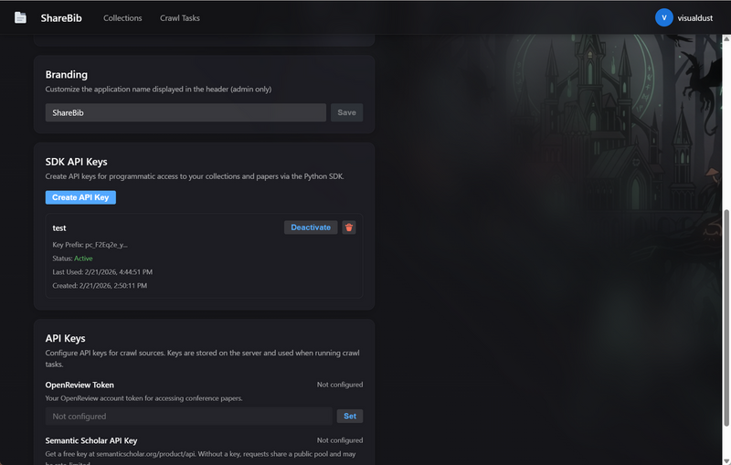

# ShareBib Python SDK

Python SDK for interacting with the ShareBib API.

## Installation

```bash
cd sdk
pip install -e .
```

Or install from PyPI (when published):

```bash
pip install sharebib
```

## Quick Start

### 1. Get Your API Key

1. Log in to your ShareBib instance
2. Go to Settings
3. In the "SDK API Keys" section, click "Create API Key"
4. Give it a name (e.g., "My Crawler Script")
5. Copy the generated key (starts with `pc_`) - you won't be able to see it again!



### 2. Use the SDK

```python
from sharebib import ShareBibClient

# Initialize the client
client = ShareBibClient(
    base_url="http://localhost:11550",  # Your ShareBib instance URL
    api_key="pc_your_api_key_here"      # Your API key
)

# Create a new collection
collection = client.create_collection(
    title="My Research Papers",
    description="Papers I'm reading",
    visibility="private",
    tags=["machine-learning", "nlp"]
)
print(f"Created collection: {collection.title} (ID: {collection.id})")

# Add a paper to the collection
paper = client.add_paper(
    collection_id=collection.id,
    title="Attention Is All You Need",
    authors=["Vaswani et al."],
    venue="NeurIPS",
    year=2017,
    abstract="The dominant sequence transduction models...",
    arxiv_id="1706.03762",
    url_arxiv="https://arxiv.org/abs/1706.03762",
    url_pdf="https://arxiv.org/pdf/1706.03762.pdf",
    tags=["transformers", "attention"]
)
print(f"Added paper: {paper.title}")

# List all papers in the collection
papers = client.list_papers(collection.id)
print(f"Collection has {len(papers)} papers")

# List all collections
collections = client.list_collections()
for c in collections:
    print(f"- {c.title} ({c.paper_count} papers)")
```

## API Reference

### Client Initialization

```python
client = ShareBibClient(base_url, api_key)
```

- `base_url`: Base URL of your ShareBib instance (e.g., `http://localhost:11550`)
- `api_key`: Your API key (get it from Settings page)

### Collection Methods

#### `list_collections() -> list[Collection]`

List all collections accessible by the user.

#### `create_collection(title, description="", visibility="private", tags=None, collection_id=None) -> Collection`

Create a new collection.

- `title`: Collection title (required)
- `description`: Collection description
- `visibility`: `"private"`, `"public"`, or `"public_editable"`
- `tags`: List of tags
- `collection_id`: Custom ID (optional, auto-generated if not provided)

#### `get_collection(collection_id) -> Collection`

Get a collection by ID.

#### `delete_collection(collection_id) -> None`

Delete a collection.

### Paper Methods

#### `add_paper(collection_id, title, **kwargs) -> Paper`

Create a new paper and add it to a collection.

Required:

- `collection_id`: Collection ID
- `title`: Paper title

Optional:

- `authors`: List of author names
- `venue`: Publication venue
- `year`: Publication year
- `abstract`: Paper abstract
- `summary`: Paper summary
- `arxiv_id`: arXiv ID
- `doi`: DOI
- `url_arxiv`: arXiv URL
- `url_pdf`: PDF URL
- `url_code`: Code repository URL
- `url_project`: Project page URL
- `tags`: List of tags

#### `list_papers(collection_id) -> list[Paper]`

List all papers in a collection.

#### `get_paper(paper_id) -> Paper`

Get a paper by ID.

#### `remove_paper(collection_id, paper_id) -> None`

Remove a paper from a collection.

## Data Models

### Collection

```python
@dataclass
class Collection:
    id: str
    title: str
    description: str
    visibility: str
    allow_export: bool
    tags: list[str]
    created_at: datetime
    updated_at: datetime
    paper_count: int
```

### Paper

```python
@dataclass
class Paper:
    id: str
    title: str
    authors: list[str]
    venue: Optional[str]
    year: Optional[int]
    abstract: Optional[str]
    summary: Optional[str]
    status: str
    arxiv_id: Optional[str]
    doi: Optional[str]
    url_arxiv: Optional[str]
    url_pdf: Optional[str]
    url_code: Optional[str]
    url_project: Optional[str]
    tags: list[str]
    created_at: datetime
    updated_at: datetime
```

## Use Cases

### 1. Custom Crawler

```python
# Crawl papers from your own source and add them to ShareBib
import requests
from sharebib import ShareBibClient

client = ShareBibClient("http://localhost:11550", "pc_your_key")

# Create a collection for today's papers
collection = client.create_collection(
    title=f"Papers - {datetime.now().strftime('%Y-%m-%d')}",
    tags=["daily-crawl"]
)

# Fetch papers from your source
papers_data = fetch_papers_from_my_source()

# Add each paper to the collection
for paper_data in papers_data:
    client.add_paper(
        collection_id=collection.id,
        title=paper_data["title"],
        authors=paper_data["authors"],
        abstract=paper_data["abstract"],
        url_pdf=paper_data["pdf_url"]
    )
```

### 2. Batch Import

```python
# Import papers from a CSV or JSON file
import csv
from sharebib import ShareBibClient

client = ShareBibClient("http://localhost:11550", "pc_your_key")
collection = client.create_collection(title="Imported Papers")

with open("papers.csv", "r") as f:
    reader = csv.DictReader(f)
    for row in reader:
        client.add_paper(
            collection_id=collection.id,
            title=row["title"],
            authors=row["authors"].split(";"),
            year=int(row["year"]) if row["year"] else None,
            doi=row["doi"]
        )
```

### 3. Sync with External Database

```python
# Keep ShareBib in sync with your research database
from sharebib import ShareBibClient

client = ShareBibClient("http://localhost:11550", "pc_your_key")

# Get or create a collection
collections = client.list_collections()
my_collection = next((c for c in collections if c.title == "My Papers"), None)
if not my_collection:
    my_collection = client.create_collection(title="My Papers")

# Sync papers
existing_papers = {p.doi: p for p in client.list_papers(my_collection.id) if p.doi}
new_papers = fetch_from_my_database()

for paper in new_papers:
    if paper["doi"] not in existing_papers:
        client.add_paper(
            collection_id=my_collection.id,
            title=paper["title"],
            doi=paper["doi"],
            # ... other fields
        )
```

## Error Handling

The SDK raises `requests.HTTPError` for API errors:

```python
from requests import HTTPError

try:
    collection = client.get_collection("nonexistent-id")
except HTTPError as e:
    if e.response.status_code == 404:
        print("Collection not found")
    elif e.response.status_code == 403:
        print("Access denied")
    else:
        print(f"Error: {e}")
```

## License

MIT
